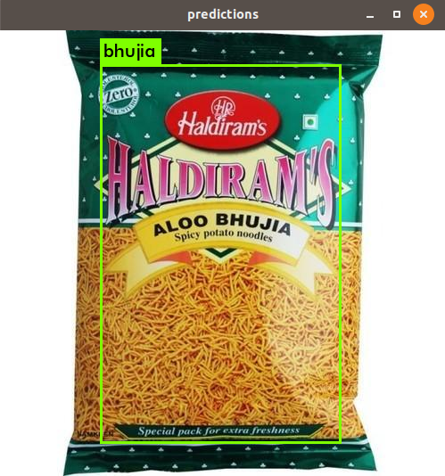
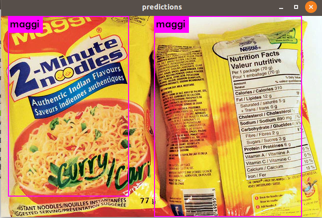
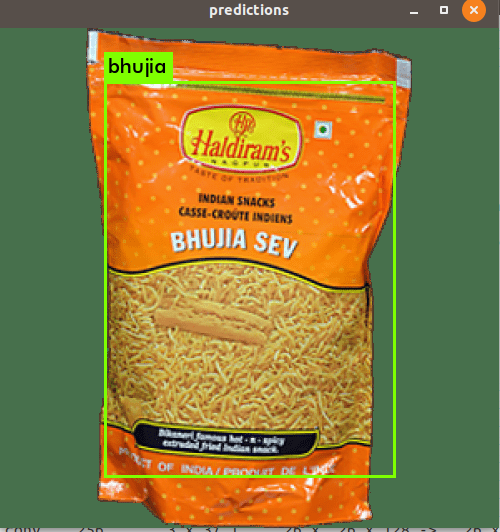

# Finito_internship

To run :-

  Linux - ./darknet detect yolov3-tiny-obj.cfg backup/yolov3-tiny-obj_6000.weights /path/to/image 
  
  Windows - darknet.exe detect yolov3-tiny-obj.cfg backup/yolov3-tiny-obj_6000.weights /path/to/image

### Results:

